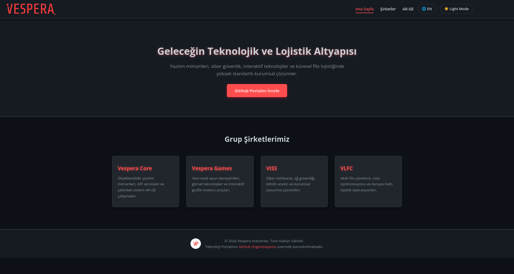
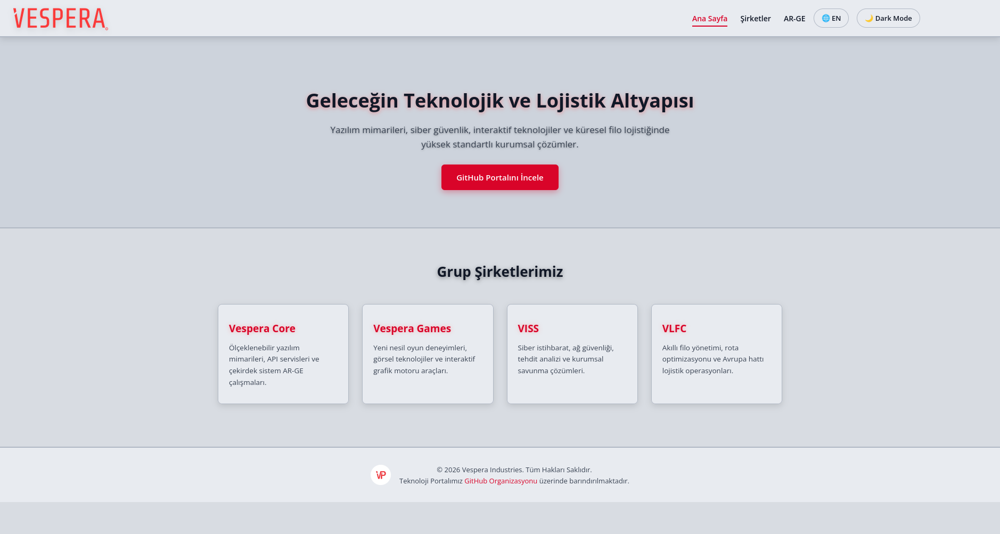

# Vespera-Burner-Web

A high-performance, dark-mode focused corporate landing page and portal for Vespera Industries. Built with modern responsive CSS, red neon accent glows, and seamless light/dark theme switching.

- also used in www.vesperaindustries.com!

## Live System Overview (Dark & White Themes)





## Project Structure

```text
vespera-burner-web/
├── .gitignore
├── LICENSE
├── README.md
├── arge.html
├── index.html
├── sirketler.html
└── assets/
    ├── css/
    │   └── auth.css
    ├── js/
    │   └── auth.js
    └── img/
        ├── logo.png
        ├── logos.png
        ├── miniicon.png
        ├── miniiconsmaller.png
        ├── web1.png
        └── web2.png
```

## Requirements

- Any modern web browser (Firefox, Chromium, Safari)
- Web Server (Nginx, Apache, or Python HTTP Server)

## Installation & Setup

1. Clone the repository:
   ```bash
   git clone git@github.com:Vespera-Industries/vespera-burner-web.git
   cd vespera-burner-web
   ```

2. Serve locally (Optional):
   ```bash
   python3 -m http.server 8000
   ```

## Features

- **Authentication System**: Full client-side Sign-Up & Sign-In modal with session state persistence, password strength meter, profile dropdown, and bilingual support (TR / EN).
- **Responsive Layout**: Designed for seamless display across all screen sizes (desktop, laptops, tablets, and mobile).
- **Dark/Light Theme Switcher**: Dynamic CSS variables for instant theme toggling.

## License

MIT License - see the [LICENSE](LICENSE) file for details.

---

<p> <em>made by <strong>trailheart</strong> with ❤️</em></p>
